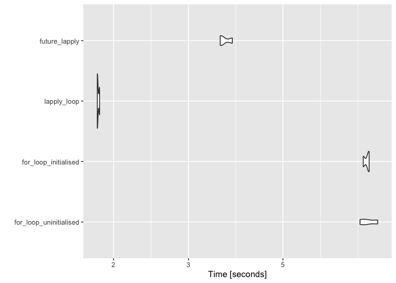
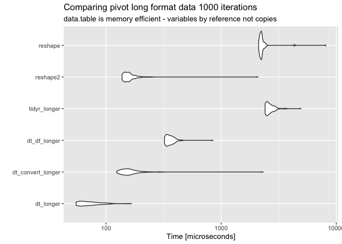
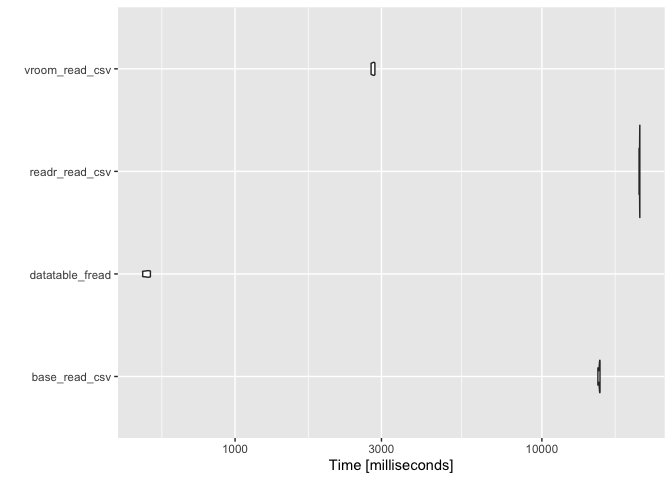
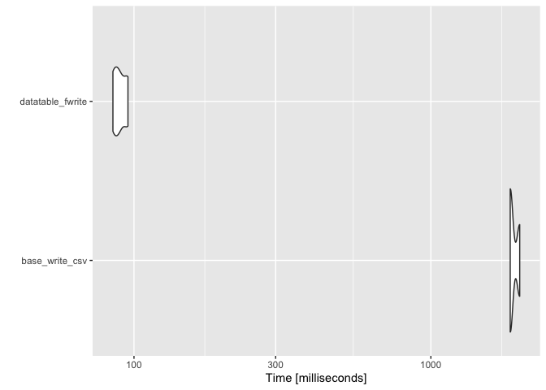

# cs-R 

Advanced features of R, things I've learned, notes, templates, and benchmarks. In this course I include things I learned during package development.

## Bullet points

1. Better string interpolation
1. Better loops: conclusion `lapply` is better, if you have big data use `future.apply::future_lapply()`
    1. Consider the shape of your data, if you have a lot of columns calculations will take a long time, parallelisation might be useful.
    1. If you must use a `for` loop, initialise its vector output: `results <- vector(mode = "list", length = how_many_elements_do_you_expect)`
    1. Use this function for printing in parallel code: `messageParallel <- function(...) {system(sprintf('echo "%s"', paste0(..., collapse = "")))}`
1. Use `data.table`:
    1. `data.table` is an extension of `data.frame` they are compatible.
    1. Reshape your data (longer/wider) with `data.table`'s `melt()` and `dcast()` - a lot faster.
    1. Read/write `csv` files with `data.table::fread()`/`data.table::fwrite()`.
1. Matrices take up less space.
1. Use this function to merge across a list by matching rownames:

```r
cbindMatchList <- function(df_list) {
    return(do.call("cbind", lapply(unname(df_list), function(index) {
        if(Reduce(function(...) {
            identical(...)
        }, lapply(df_list, "rownames"))) {
            return(index[match(rownames(df_list[[1]]), rownames(index)),])
        } else {
            stop('Your rownames could not be matched across the whole list.')
        }
    })))
}
```

## Useful syntax

Here is some code and syntax I found myself using and re-using.

### Better stringr interpolation


```r
how_long <- "very long"
paste('This is a', how_long, 'string...', sep = " ")
```

```
## [1] "This is a very long string..."
```


```r
how_long <- "very long"
stringr::str_interp('This is a ${how_long} string...')
```

```
## [1] "This is a very long string..."
```


```r
for (i in seq_along(iris[,-ncol(iris)])) {
    print(stringr::str_interp('The mean for the column ${colnames(iris)[i]} is: ${round(mean(iris[,i]), 5)}'))
}
```

```
## [1] "The mean for the column Sepal.Length is: 5.84333"
## [1] "The mean for the column Sepal.Width is: 3.05733"
## [1] "The mean for the column Petal.Length is: 3.758"
## [1] "The mean for the column Petal.Width is: 1.19933"
```

### Better loops


```r
separate_species <- vector(mode = "list", length = length(unique(iris$Species)))
for (i in seq_along(unique(iris$Species))) {
    separate_species[[i]] <- iris[as.character(iris$Species) == as.character(unique(iris$Species)[i]), -ncol(iris)]
    
    max_val <- max(separate_species[[i]])
    print(max_val)
}
```

```
## [1] 5.8
## [1] 7
## [1] 7.9
```


```r
max_val
```

```
## [1] 7.9
```

```r
i
```

```
## [1] 3
```


```r
species_names <- as.character(unique(iris$Species))
names(species_names) <- species_names

apply_sep <- lapply(species_names, function(species_names) {
    species <- iris[iris$Species == species_names, -ncol(iris)]
    print(max(species))
    return(species)
})
```

```
## [1] 5.8
## [1] 7
## [1] 7.9
```

#### Proof it's better

Let's benchmark these two methods. Applies also work over `data.frames`, use all applies for going over columns, and `apply` with a margin of `1` for going over rows.

Let's start by simulating some data.

##### ncol 10k nrow 40


```r
generated_data <- (function(offset_min, offset_max, num_cols, num_samples) {
   generated_data <- list(
        subject_a = replicate(n = num_samples, expr = runif(n = num_cols, min = 10, max = 15), simplify = "data.frame"),
        subject_b = replicate(n = num_samples, expr = runif(n = num_cols, min = 10 + offset_min, max = 15 + offset_max), simplify = "data.frame")
    )
    
    generated_data <- mapply(function(data, group_name) { # this is a multivariate apply
        data <- as.data.frame(t(data))
        colnames(data) <- paste(rep("gene", ncol(data)), 1:ncol(data), sep = "_")
        data$subject <- group_name
        data$condition <- "control"
        return(data[,c("subject", "condition", setdiff(colnames(data), c("subject", "condition")))])
    }, generated_data, names(generated_data), SIMPLIFY = FALSE)
    
    bound_data <- do.call("rbind", unname(generated_data))
    
    bound_data$subject <- make.names(bound_data$subject, unique = TRUE)
    
    bound_data[((nrow(bound_data) / 2) + 1):nrow(bound_data),]$condition <- "test"
    return(bound_data)
})(100, 150, num_cols = 10000, num_samples = 40)

# let's save this for later
data.table::fwrite(generated_data, "./data/generated-data.csv")
```


```r
generateData <- function(offset_min, offset_max, num_cols, num_samples) {
   generated_data <- list(
        subject_a = replicate(n = num_samples, expr = runif(n = num_cols, min = 10, max = 15), simplify = "data.frame"),
        subject_b = replicate(n = num_samples, expr = runif(n = num_cols, min = 10 + offset_min, max = 15 + offset_max), simplify = "data.frame")
    )
    
    generated_data <- mapply(function(data, group_name) { # this is a multivariate apply
        data <- as.data.frame(t(data))
        colnames(data) <- paste(rep("gene", ncol(data)), 1:ncol(data), sep = "_")
        data$subject <- group_name
        data$condition <- "control"
        return(data[,c("subject", "condition", setdiff(colnames(data), c("subject", "condition")))])
    }, generated_data, names(generated_data), SIMPLIFY = FALSE)
    
    bound_data <- do.call("rbind", unname(generated_data))
    
    bound_data$subject <- make.names(bound_data$subject, unique = TRUE)
    
    bound_data[((nrow(bound_data) / 2) + 1):nrow(bound_data),]$condition <- "test"
    return(bound_data)
}
```

Let's do a simple t-test a relatively simple operation.


```r
head(generated_data[, 1:5])
```

```
##       subject condition   gene_1   gene_2   gene_3
## 1   subject_a   control 11.23699 14.57881 12.40960
## 2 subject_a.1   control 12.88533 14.22547 13.30686
## 3 subject_a.2   control 13.18088 14.38179 12.81883
## 4 subject_a.3   control 14.96860 13.70888 14.60143
## 5 subject_a.4   control 11.91170 13.59393 13.22436
## 6 subject_a.5   control 10.91992 10.82250 12.63721
```

```r
tail(generated_data[, 1:5])
```

```
##         subject condition   gene_1   gene_2   gene_3
## 75 subject_b.34      test 135.6714 160.8790 129.2394
## 76 subject_b.35      test 146.0346 134.3072 130.5009
## 77 subject_b.36      test 157.9893 113.9051 127.4367
## 78 subject_b.37      test 112.1295 160.5303 110.0388
## 79 subject_b.38      test 132.9362 164.2841 163.7570
## 80 subject_b.39      test 155.4719 149.8519 116.3314
```

```r
dim(generated_data)
```

```
## [1]    80 10002
```


```r
for_vs_lapply <- microbenchmark::microbenchmark(
    for_loop_uninitialised = ({
        results <- vector()
        for (i in 1:(ncol(generated_data) - 2)) {
            results[i] <- t.test(
                generated_data[, -c(1, 2)][generated_data$condition == "control", i],
                generated_data[, -c(1, 2)][generated_data$condition == "test", i],
                var.equal = TRUE
            )$p.value
        }
    }),
    for_loop_initialised = ({
        results <- vector(mode = "list", length = (ncol(generated_data) - 2))
        for (i in 1:(ncol(generated_data) - 2)) {
            results[i] <- t.test(
                generated_data[, -c(1, 2)][generated_data$condition == "control", i],
                generated_data[, -c(1, 2)][generated_data$condition == "test", i],
                var.equal = TRUE
            )$p.value
        }
    }),
    lapply_loop = ({
        lapply(generated_data[,-c(1, 2)], function(column) {
            # print(data)
            t.test(
                column[generated_data$condition == "control"],
                column[generated_data$condition == "test"],
                var.equal = TRUE
            )$p.value
        })
    }),
    future_lapply = ({
        future::plan(strategy = "multisession", workers = future::availableCores())
        future.apply::future_lapply(generated_data[,-c(1, 2)], function(column) {
            t.test(
                column[generated_data$condition == "control"],
                column[generated_data$condition == "test"],
                var.equal = TRUE
            )$p.value
        })
    }),
    times = 3
)

ggplot2::autoplot(for_vs_lapply)
```

```
## Coordinate system already present. Adding new coordinate system, which will replace the existing one.
```

<!-- -->

Consider the shape of your data, how many subjects how many observations? 

##### ncol 10k nrow 1.5k


```r
generated_data <- generateData(100, 150, num_cols = 7500, num_samples = 1500)
```

Let's do a simple t-test a relatively simple operation.


```r
head(generated_data[, 1:5])
```

```
##       subject condition   gene_1   gene_2   gene_3
## 1   subject_a   control 13.24246 10.99030 13.54377
## 2 subject_a.1   control 11.95518 11.37059 14.58049
## 3 subject_a.2   control 13.70782 11.32466 12.41658
## 4 subject_a.3   control 13.65184 14.99207 13.88512
## 5 subject_a.4   control 13.97455 14.12639 11.76510
## 6 subject_a.5   control 14.86573 14.94663 14.24125
```

```r
tail(generated_data[, 1:5])
```

```
##             subject condition   gene_1   gene_2   gene_3
## 2995 subject_b.1494      test 143.3271 116.8602 116.4717
## 2996 subject_b.1495      test 138.6813 121.2900 146.3535
## 2997 subject_b.1496      test 135.4057 117.7143 161.8835
## 2998 subject_b.1497      test 131.0370 159.5987 149.9702
## 2999 subject_b.1498      test 142.6950 116.6863 154.3085
## 3000 subject_b.1499      test 126.1240 115.3776 146.1258
```

```r
dim(generated_data)
```

```
## [1] 3000 7502
```


```r
for_vs_lapply <- microbenchmark::microbenchmark(
    for_loop_uninitialised = ({
        results <- vector()
        for (i in 1:(ncol(generated_data) - 2)) {
            results[i] <- t.test(
                generated_data[, -c(1, 2)][generated_data$condition == "control", i],
                generated_data[, -c(1, 2)][generated_data$condition == "test", i],
                var.equal = TRUE
            )$p.value
        }
    }),
    for_loop_initialised = ({
        results <- vector(mode = "list", length = (ncol(generated_data) - 2))
        for (i in 1:(ncol(generated_data) - 2)) {
            results[i] <- t.test(
                generated_data[, -c(1, 2)][generated_data$condition == "control", i],
                generated_data[, -c(1, 2)][generated_data$condition == "test", i],
                var.equal = TRUE
            )$p.value
        }
    }),
    lapply_loop = ({
        lapply(generated_data[,-c(1, 2)], function(column) {
            # print(data)
            t.test(
                column[generated_data$condition == "control"],
                column[generated_data$condition == "test"],
                var.equal = TRUE
            )$p.value
        })
    }),
    future_lapply = ({
        future::plan(strategy = "multisession", workers = future::availableCores())
        future.apply::future_lapply(generated_data[,-c(1, 2)], function(column) {
            t.test(
                column[generated_data$condition == "control"],
                column[generated_data$condition == "test"],
                var.equal = TRUE
            )$p.value
        })
    }),
    times = 3
)

ggplot2::autoplot(for_vs_lapply)
```

```
## Coordinate system already present. Adding new coordinate system, which will replace the existing one.
```

<!-- -->

### Messaging and printing in future applies


```r
generated_data <- generateData(100, 150, num_cols = 5, num_samples = 10)
```


```r
invisible(mapply(function(column, column_name) {
    message(stringr::str_interp('We are on this column: ${column_name}'))
    t.test(
        column[generated_data$condition == "control"],
        column[generated_data$condition == "test"],
        var.equal = TRUE
    )$p.value
}, generated_data[,-c(1, 2)], names(generated_data[,-c(1, 2)]), SIMPLIFY = FALSE))
```

```
## We are on this column: gene_1
```

```
## We are on this column: gene_2
```

```
## We are on this column: gene_3
```

```
## We are on this column: gene_4
```

```
## We are on this column: gene_5
```


```r
future::plan(strategy = "multisession", workers = future::availableCores())
invisible(future.apply::future_mapply(function(column, column_name) {
    message(stringr::str_interp('We are on this column: ${column_name}'))
    t.test(
        column[generated_data$condition == "control"],
        column[generated_data$condition == "test"],
        var.equal = TRUE
    )$p.value
}, generated_data[,-c(1, 2)], names(generated_data[,-c(1, 2)]), SIMPLIFY = FALSE))
```

```r
messageParallel <- function(...) {
    system(sprintf('echo "%s"', paste0(..., collapse = "")))
}

future::plan(strategy = "multisession", workers = future::availableCores())
invisible(future.apply::future_mapply(function(column, column_name) {
    messageParallel(stringr::str_interp('We are on this column: ${column_name}'))
    t.test(
        column[generated_data$condition == "control"],
        column[generated_data$condition == "test"],
        var.equal = TRUE
    )$p.value
}, generated_data[,-c(1, 2)], names(generated_data[,-c(1, 2)]), SIMPLIFY = FALSE))
```

```
## We are on this column: gene_1
```

```
## We are on this column: gene_2
```

```
## We are on this column: gene_3
```

```
## We are on this column: gene_4
```

```
## We are on this column: gene_5
```

# Memory and efficient coding

## `data.table`

Melting data, pivot from wide to long dataset.

```r
df_data <- as.data.frame(tidyr::relig_income)
tib_data <- tidyr::as_tibble(tidyr::relig_income)
DT_data <- data.table::as.data.table(tidyr::relig_income) # converts data which is a data.frame to data.table *by reference*
```


```r
data.table::melt(DT_data, id.vars = "religion")
```

```
##                   religion           variable value
##   1:              Agnostic              <$10k    27
##   2:               Atheist              <$10k    12
##   3:              Buddhist              <$10k    27
##   4:              Catholic              <$10k   418
##   5:    Don’t know/refused              <$10k    15
##  ---                                               
## 176:              Orthodox Don't know/refused    73
## 177:       Other Christian Don't know/refused    18
## 178:          Other Faiths Don't know/refused    71
## 179: Other World Religions Don't know/refused     8
## 180:          Unaffiliated Don't know/refused   597
```

```r
tidyr::pivot_longer(tib_data, -religion)
```

```
## # A tibble: 180 x 3
##    religion name               value
##    <chr>    <chr>              <dbl>
##  1 Agnostic <$10k                 27
##  2 Agnostic $10-20k               34
##  3 Agnostic $20-30k               60
##  4 Agnostic $30-40k               81
##  5 Agnostic $40-50k               76
##  6 Agnostic $50-75k              137
##  7 Agnostic $75-100k             122
##  8 Agnostic $100-150k            109
##  9 Agnostic >150k                 84
## 10 Agnostic Don't know/refused    96
## # … with 170 more rows
```

```r
reshape2::melt(df_data, id.vars = "religion")
```

```
##                    religion           variable value
## 1                  Agnostic              <$10k    27
## 2                   Atheist              <$10k    12
## 3                  Buddhist              <$10k    27
## 4                  Catholic              <$10k   418
## 5        Don’t know/refused              <$10k    15
## 6          Evangelical Prot              <$10k   575
## 7                     Hindu              <$10k     1
## 8   Historically Black Prot              <$10k   228
## 9         Jehovah's Witness              <$10k    20
## 10                   Jewish              <$10k    19
## [ reached 'max' / getOption("max.print") -- omitted n rows ]
```

```r
reshape::melt(df_data, id.vars = "religion")
```

```
##                    religion           variable value
## 1                  Agnostic              <$10k    27
## 2                   Atheist              <$10k    12
## 3                  Buddhist              <$10k    27
## 4                  Catholic              <$10k   418
## 5        Don’t know/refused              <$10k    15
## 6          Evangelical Prot              <$10k   575
## 7                     Hindu              <$10k     1
## 8   Historically Black Prot              <$10k   228
## 9         Jehovah's Witness              <$10k    20
## 10                   Jewish              <$10k    19
## [ reached 'max' / getOption("max.print") -- omitted n rows ]
```


```r
bench_pivoting <- microbenchmark::microbenchmark(
    dt_longer = data.table::melt(DT_data, id.vars = "religion"),
    dt_convert_longer = data.table::melt(data.table::as.data.table(df_data), id.vars = "religion"),
    dt_df_longer = data.table::melt(df_data, id.vars = "religion"),
    tidyr_longer = tidyr::pivot_longer(tib_data, -religion),
    reshape2 = reshape2::melt(df_data, id.vars = "religion"),
    reshape = reshape::melt(df_data, id.vars = "religion"),
    times = 100
)
```

```r
ggplot2::autoplot(bench_pivoting) +
    ggplot2::labs(title = "Comparing pivot long format data 1000 iterations", subtitle = "data.table is memory efficient - variables by reference not copies")
```

```
## Coordinate system already present. Adding new coordinate system, which will replace the existing one.
```

<!-- -->

## Reading in data

A lot of different options: `read.csv`, `read_csv`, `vroom`, `fread`. 


```r
reading_csv <- microbenchmark::microbenchmark(
    base_read_csv = ({data <- read.csv("./data/generated-data.csv")}),
    datatable_fread = ({data <- data.table::fread("./data/generated-data.csv")}),
    readr_read_csv = ({data <- readr::read_csv("./data/generated-data.csv")}),
    vroom_read_csv = ({data <- vroom::vroom("./data/generated-data.csv")}),
    times = 3
)
```

```r
ggplot2::autoplot(reading_csv)
```

```
## Coordinate system already present. Adding new coordinate system, which will replace the existing one.
```

<!-- -->

## Writing data


```r
read_in_data <- data.table::fread("./data/generated-data.csv")

writing_csv <- microbenchmark::microbenchmark(
    base_write_csv = ({write.csv(read_in_data, "./data/write-test-generated-data.csv")}),
    datatable_fwrite = ({data.table::fwrite(read_in_data, "./data/write-test-generated-data.csv")}),
    times = 3
)

ggplot2::autoplot(writing_csv)
```

```
## Coordinate system already present. Adding new coordinate system, which will replace the existing one.
```

<!-- -->

## Data structures and manipulation

### Object sizing

Matrices are better than data.frames. Consider the shape of your data, do you have a large number of columns?


```r
m <- matrix(1:400000, 200000, 2)
d <- data.frame(m)

object.size(m)
```

```
## 1600216 bytes
```

```r
object.size(d)
```

```
## 1600848 bytes
```

```r
dim(m)
```

```
## [1] 200000      2
```


```r
m <- matrix(1:400000, 2, 200000)
d <- data.frame(m)
object.size(m)
```

```
## 1600216 bytes
```

```r
object.size(d)
```

```
## 25600608 bytes
```

```r
dim(m)
```

```
## [1]      2 200000
```

### Matching rows across list to merge


```r
list_gen_data <- list(
    generated_data1 = generateData(1, 2, num_cols = 3, num_samples = 7),
    generated_data2 = generateData(1, 3, num_cols = 3, num_samples = 7)
)

list_gen_data <- lapply(list_gen_data, function(data) {
    rownames(data) <- data$subject
    return(data[,-c(1, 2)])
})

list_gen_data$generated_data1 <- list_gen_data$generated_data1[order(list_gen_data$generated_data1$gene_1),]
list_gen_data$generated_data2 <- list_gen_data$generated_data2[order(list_gen_data$generated_data2$gene_2),]
```

Re-order and merge?


```r
list_gen_data <- lapply(list_gen_data, function(list_item) {
    list_item[order(rownames(list_item)),]
})

do.call("cbind", unname(list_gen_data))
```

```
##               gene_1   gene_2   gene_3   gene_1   gene_2   gene_3
## subject_a   12.68507 14.24490 10.75648 11.21206 13.25907 14.45536
## subject_a.1 12.92148 10.77268 10.40092 13.65148 14.04845 11.38639
## subject_a.2 14.00676 12.05971 12.37896 12.07238 14.75446 10.36797
## subject_a.3 12.14339 10.41500 11.53333 12.19432 10.58976 13.31153
## subject_a.4 14.11516 10.93391 11.33685 11.03708 10.28223 11.92647
## subject_a.5 10.58244 14.41713 13.10027 12.33496 10.62897 11.93101
## subject_a.6 14.70494 13.33307 10.00807 10.70271 11.52116 12.53080
## subject_b   14.25293 13.63079 15.84343 15.56593 13.72047 15.17469
## subject_b.1 14.91686 13.79518 11.36008 14.53767 12.68796 11.15143
## subject_b.2 11.33795 15.80622 15.90950 14.40384 13.14216 17.24636
## subject_b.3 13.63937 14.96368 12.36944 13.16554 12.17066 12.91020
## subject_b.4 16.93455 16.21821 15.93083 14.53568 11.32054 11.69458
## subject_b.5 14.85176 13.00448 13.42196 15.08215 12.31193 12.05369
## subject_b.6 11.16582 14.53229 12.06831 14.13001 15.07943 16.37960
```


```r
cbindMatchList <- function(df_list) {
    return(do.call("cbind", lapply(unname(df_list), function(index) {
        if(Reduce(function(...) {
            identical(...)
        }, lapply(df_list, "rownames"))) {
            return(index[match(rownames(df_list[[1]]), rownames(index)),])
        } else {
            stop('Your rownames could not be matched across the whole list.')
        }
    })))
}
```


```r
cbindMatchList(list_gen_data)
```

```
##               gene_1   gene_2   gene_3   gene_1   gene_2   gene_3
## subject_a   12.68507 14.24490 10.75648 11.21206 13.25907 14.45536
## subject_a.1 12.92148 10.77268 10.40092 13.65148 14.04845 11.38639
## subject_a.2 14.00676 12.05971 12.37896 12.07238 14.75446 10.36797
## subject_a.3 12.14339 10.41500 11.53333 12.19432 10.58976 13.31153
## subject_a.4 14.11516 10.93391 11.33685 11.03708 10.28223 11.92647
## subject_a.5 10.58244 14.41713 13.10027 12.33496 10.62897 11.93101
## subject_a.6 14.70494 13.33307 10.00807 10.70271 11.52116 12.53080
## subject_b   14.25293 13.63079 15.84343 15.56593 13.72047 15.17469
## subject_b.1 14.91686 13.79518 11.36008 14.53767 12.68796 11.15143
## subject_b.2 11.33795 15.80622 15.90950 14.40384 13.14216 17.24636
## subject_b.3 13.63937 14.96368 12.36944 13.16554 12.17066 12.91020
## subject_b.4 16.93455 16.21821 15.93083 14.53568 11.32054 11.69458
## subject_b.5 14.85176 13.00448 13.42196 15.08215 12.31193 12.05369
## subject_b.6 11.16582 14.53229 12.06831 14.13001 15.07943 16.37960
```

All this chunk is doing is returning your list of `data.frames` but with `rownames` in matching order. If there is a mismatch somewhere, an error is thrown.


```r
lapply(unname(list_gen_data), function(index) {
    if (Reduce(function(...) {
        identical(...)
    }, lapply(list_gen_data, "rownames"))) {
        return(index[match(rownames(list_gen_data[[1]]), rownames(index)), ])
    } else {
        stop('Your rownames could not be matched across the whole list.')
    }
})
```

```
## [[1]]
##               gene_1   gene_2   gene_3
## subject_a   12.68507 14.24490 10.75648
## subject_a.1 12.92148 10.77268 10.40092
## subject_a.2 14.00676 12.05971 12.37896
## subject_a.3 12.14339 10.41500 11.53333
## subject_a.4 14.11516 10.93391 11.33685
## subject_a.5 10.58244 14.41713 13.10027
## subject_a.6 14.70494 13.33307 10.00807
## subject_b   14.25293 13.63079 15.84343
## subject_b.1 14.91686 13.79518 11.36008
## subject_b.2 11.33795 15.80622 15.90950
## subject_b.3 13.63937 14.96368 12.36944
## subject_b.4 16.93455 16.21821 15.93083
## subject_b.5 14.85176 13.00448 13.42196
## subject_b.6 11.16582 14.53229 12.06831
## 
## [[2]]
##               gene_1   gene_2   gene_3
## subject_a   11.21206 13.25907 14.45536
## subject_a.1 13.65148 14.04845 11.38639
## subject_a.2 12.07238 14.75446 10.36797
## subject_a.3 12.19432 10.58976 13.31153
## subject_a.4 11.03708 10.28223 11.92647
## subject_a.5 12.33496 10.62897 11.93101
## subject_a.6 10.70271 11.52116 12.53080
## subject_b   15.56593 13.72047 15.17469
## subject_b.1 14.53767 12.68796 11.15143
## subject_b.2 14.40384 13.14216 17.24636
## subject_b.3 13.16554 12.17066 12.91020
## subject_b.4 14.53568 11.32054 11.69458
## subject_b.5 15.08215 12.31193 12.05369
## subject_b.6 14.13001 15.07943 16.37960
```

This is where the matching `rownames` are checked.


```r
list_rownames <- lapply(list_gen_data, "rownames")
list_rownames
```

```
## $generated_data1
##  [1] "subject_a"   "subject_a.1" "subject_a.2" "subject_a.3" "subject_a.4"
##  [6] "subject_a.5" "subject_a.6" "subject_b"   "subject_b.1" "subject_b.2"
## [11] "subject_b.3" "subject_b.4" "subject_b.5" "subject_b.6"
## 
## $generated_data2
##  [1] "subject_a"   "subject_a.1" "subject_a.2" "subject_a.3" "subject_a.4"
##  [6] "subject_a.5" "subject_a.6" "subject_b"   "subject_b.1" "subject_b.2"
## [11] "subject_b.3" "subject_b.4" "subject_b.5" "subject_b.6"
```


```r
Reduce(function(...) {
    identical(...)
}, list_rownames)
```

```
## [1] TRUE
```

```r
identical(list_rownames$generated_data1, list_rownames$generated_data2)
```

```
## [1] TRUE
```

# Session info


```r
sessionInfo()
```

```
## R version 4.0.5 (2021-03-31)
## Platform: x86_64-apple-darwin17.0 (64-bit)
## Running under: macOS Big Sur 10.16
## 
## Matrix products: default
## BLAS:   /Library/Frameworks/R.framework/Versions/4.0/Resources/lib/libRblas.dylib
## LAPACK: /Library/Frameworks/R.framework/Versions/4.0/Resources/lib/libRlapack.dylib
## 
## locale:
## [1] en_US.UTF-8/en_US.UTF-8/en_US.UTF-8/C/en_US.UTF-8/en_US.UTF-8
## 
## attached base packages:
## [1] stats     graphics  grDevices utils     datasets  methods   base     
## 
## loaded via a namespace (and not attached):
##  [1] tidyselect_1.1.0     xfun_0.22            bslib_0.2.4         
##  [4] purrr_0.3.4          reshape2_1.4.4       listenv_0.8.0       
##  [7] colorspace_2.0-0     vctrs_0.3.7          generics_0.1.0      
## [10] htmltools_0.5.1.1    yaml_2.2.1           utf8_1.2.1          
## [13] rlang_0.4.10         jquerylib_0.1.3      pillar_1.6.0        
## [16] glue_1.4.2           DBI_1.1.1            bit64_4.0.5         
## [19] lifecycle_1.0.0      plyr_1.8.6           stringr_1.4.0       
## [22] munsell_0.5.0        gtable_0.3.0         future_1.21.0       
## [25] codetools_0.2-18     evaluate_0.14        labeling_0.4.2      
## [28] knitr_1.31           parallel_4.0.5       fansi_0.4.2         
## [31] highr_0.8            Rcpp_1.0.6           readr_1.4.0         
## [34] scales_1.1.1         vroom_1.4.0          jsonlite_1.7.2      
## [37] bit_4.0.4            farver_2.1.0         parallelly_1.25.0   
## [40] microbenchmark_1.4-7 hms_1.0.0            ggplot2_3.3.3       
## [43] digest_0.6.27        stringi_1.5.3        dplyr_1.0.5         
## [46] grid_4.0.5           cli_2.4.0            tools_4.0.5         
## [49] magrittr_2.0.1       sass_0.3.1           tibble_3.1.0        
## [52] crayon_1.4.1         tidyr_1.1.3          future.apply_1.8.1  
## [55] pkgconfig_2.0.3      ellipsis_0.3.1       data.table_1.14.0   
## [58] assertthat_0.2.1     rmarkdown_2.7        reshape_0.8.8       
## [61] rstudioapi_0.13      R6_2.5.0             globals_0.14.0      
## [64] compiler_4.0.5
```
